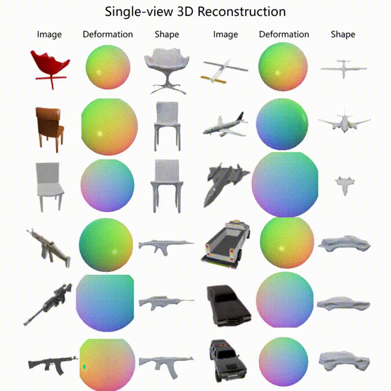

# GenMesh

The is the released codes for "Single-view 3D Mesh Reconstruction for Seen and Unseen Categories". Published in IEEE Transactions on Image Processing (TIP).

[Paper](https://ieeexplore.ieee.org/document/10138738) -
[Arxiv](https://arxiv.org/abs/2303.04341)

## TODO
- [x] Upload the data processing codes.
- [ ] Upload dataset and update the download link.
- [ ] Clean the codes.
  
## Requirements
The codes have been tested on the linux Ubuntu 20.04 system with NVIDIA RTX3090ti. The enviroment inlcude:
* Python=3.9
* Pytorch=1.12.1
* Torchvision=0.13.1
* CUDA=11.6
  
Please clone the repository and navigate into it in your terminal, its location is assumed for all subsequent commands.

## Installation
The `environment.yaml` file contains all necessary python dependencies for the project. You can create the anaconda environment using: 
```
conda env create -f nvf.yml
conda activate nvf
```
There are other dependencies to be installed.

1. To train and test the model, libaries for [chamfer distance](https://github.com/otaheri/chamfer_distance), 
2. To test the model, [earth mover distance](https://github.com/daerduoCarey/PyTorchEMD) are needed. 

The commands have been incorperated by `create_env.sh`. You can install them via runing the script:
```
pip install git+'https://github.com/otaheri/chamfer_distance'
cd PyTorchEMD
python setup.py install
```
Or you can install step by step by yourself.

## Data Preparation
Dowanload the ShapeNet dataset and corresponding [renderings](). We provide our renderings and split file here. Run the preprocess scipt in the fold `preprossing/` to normalize the mesh. We also provide the processed files here.

## Training
To visualize the generated meshes, make sure you lauch the visdom server before trianing.
```
python -m visdom.server
```
You can run it in the background mode or on a sperate wiwindow. Or if you don't need it, comment the visulization lines in the codes. To train your NVF, you can change the parameters in the configs and run:
```
bash train.sh
```
In the `log/ `folder you can find an experiment folder containing the model checkpoints. You can monitor the training and visulization using visdom with link http://localhost:8077.

Please specify the desired model before running.
## Test
To test results after generation:
```
python test.py
```
Please specify the desired experiment name before running.

## Contact
For questions and comments please leave your questions in the issue or contact Xianghui Yang via email xianghui.yang@sydney.edu.au.

## Acknowledgement
Part of the renderings (13 catergories over 16) are downloaded from [3D-R2N2](https://github.com/chrischoy/3D-R2N2). Thanks for their releasing.
The point encoder is pointnet++ implemented by [Michael Danielczuk](https://github.com/mjd3/pointnet2). Thanks for his implementation.

## Citation
If you find our work useful, please cite our paper. :smile:
```
@ARTICLE{10138738,
  author={Yang, Xianghui and Lin, Guosheng and Zhou, Luping},
  journal={IEEE Transactions on Image Processing}, 
  title={Single-view 3D Mesh Reconstruction for Seen and Unseen Categories}, 
  year={2023},
  volume={},
  number={},
  pages={1-1},
  doi={10.1109/TIP.2023.3279661}}

```